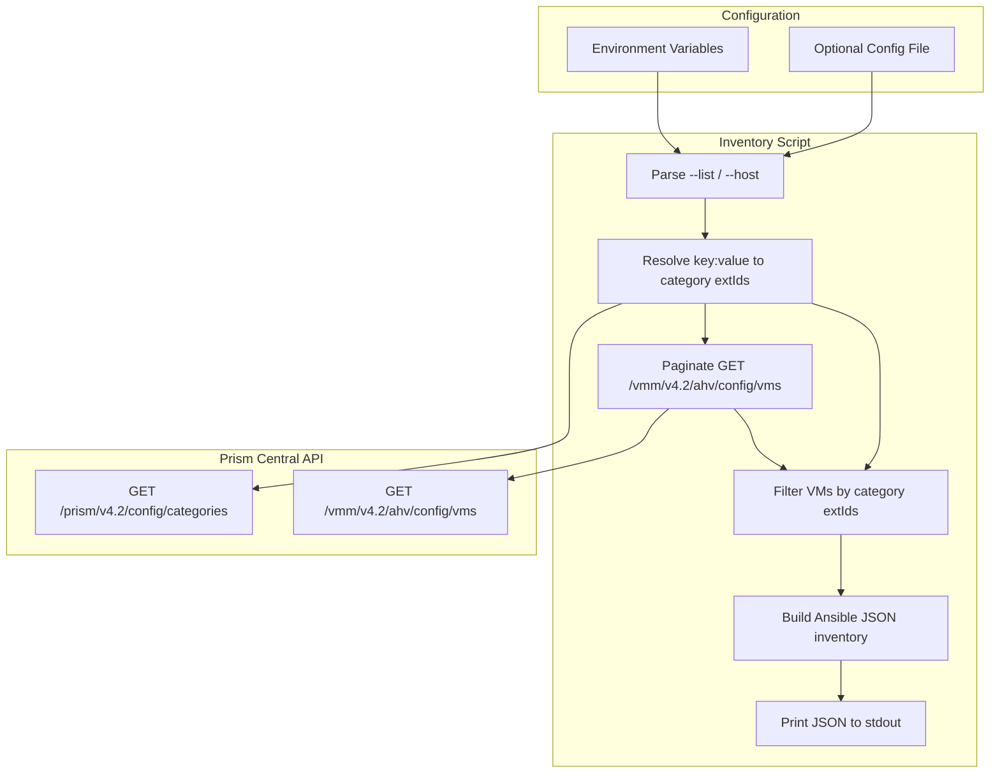

# Nutanix API v4 Dynamic Inventory for Ansible

A Python-based dynamic inventory script that queries Nutanix Prism Central via API v4 for AHV virtual machines matching specified category key:value pairs, and outputs Ansible-compatible JSON inventory.

## Architecture



## Category Matching Modes

| Mode | Behavior |
|------|----------|
| `any` (default) | VM is included if it has **at least one** of the specified categories (OR logic) |
| `all` | VM is included only if it has **every** specified category (AND logic) |

Example: with `categories: [Environment:Production, App:Web]`:
- **`any`** – VMs tagged with `Environment:Production` OR `App:Web`
- **`all`** – VMs tagged with both `Environment:Production` AND `App:Web`

## How It Works

1. **Configuration loading** – The script reads credentials and category filters from environment variables or an optional YAML config file. Environment variables take precedence.

2. **Category resolution** – For each `key:value` pair (e.g., `Environment:Production`), the script queries the Prism Central categories API (`GET /api/prism/v4.2/config/categories`) with an OData filter to resolve the category `extId` (UUID).

3. **VM listing** – The script fetches all AHV VMs from the VMM API (`GET /api/vmm/v4.2/ahv/config/vms`) with pagination, selecting only the fields needed for inventory (`extId`, `name`, `categories`, `guestTools`, `nics`).

4. **Client-side filtering** – Because the VMM API does not support server-side filtering by category, the script filters VMs client-side:
   - **`category_match: any`** (default) – VM is included if it has at least one of the specified categories.
   - **`category_match: all`** – VM is included only if it has every specified category.

5. **Host identification** – For each matching VM, `ansible_host` is derived in this order: first NIC IP address (from learned or static config), Nutanix Guest Tools `dnsName` (FQDN), or VM name. The VM IP is also stored explicitly in `nutanix_vm_ip` for display and templating.

6. **Inventory output** – The script outputs Ansible dynamic inventory JSON with a main `nutanix_vms` group, optional `cat_*` sub-groups per category, and `_meta.hostvars` for all host variables (avoids per-host `--host` calls).

## Configuration

### Environment Variables

| Variable | Required | Description |
|----------|----------|-------------|
| `NUTANIX_HOST` | Yes | Prism Central IP or FQDN |
| `NUTANIX_USERNAME` | Yes | Basic auth username |
| `NUTANIX_PASSWORD` | Yes | Basic auth password |
| `NUTANIX_CATEGORIES` | Yes | Comma-separated `key:value` pairs (e.g., `Environment:Production,App:Web`) |
| `NUTANIX_CATEGORY_MATCH` | No | `any` (default) or `all` – match VMs with ANY category vs ALL categories |
| `NUTANIX_CONFIG` | No | Path to YAML config file (if not using default location) |
| `NUTANIX_VERIFY_SSL` | No | Set to `true` to verify SSL certs (default: `false` for self-signed) |
| `NUTANIX_ANSIBLE_PORT` | No | SSH port for hosts (default: `22`) |

### Config File

Place `nutanix_inventory.yml` alongside the script or set `NUTANIX_CONFIG` to its path. The config file can be encrypted with `ansible-vault` for credential storage.

```yaml
host: "pc.example.com"  # or 10.0.0.1
username: "admin"
password: "secret"
categories:
  - "Environment:Production"
  - "App:Web"
category_match: any   # or "all" for VMs that must have every category
verify_ssl: false
ansible_port: 22
```

Environment variables override config file values.

## Usage

### Prerequisites

```bash
pip install -r requirements.txt
```

### Basic Usage

**Using environment variables:**

```bash
export NUTANIX_HOST=pc.example.com
export NUTANIX_USERNAME=admin
export NUTANIX_PASSWORD=secret
export NUTANIX_CATEGORIES="Environment:Production,App:Web"

# List full inventory
ansible-inventory -i nutanix_inventory.py --list

# Visualize groups
ansible-inventory -i nutanix_inventory.py --graph

# Run playbook against matching VMs
ansible nutanix_vms -m ping -i nutanix_inventory.py

# Run against a category-specific group
ansible cat_Environment_Production -m ping -i nutanix_inventory.py

# Match VMs that have ALL specified categories (AND logic)
export NUTANIX_CATEGORY_MATCH=all
ansible-inventory -i nutanix_inventory.py --list
```

**Using config file:**

```bash
# Config file at ./nutanix_inventory.yml (default)
ansible-inventory -i nutanix_inventory.py --list

# Or specify config path
export NUTANIX_CONFIG=/path/to/nutanix_inventory.yml
ansible-inventory -i nutanix_inventory.py --list
```

### Ansible Configuration

Add to `ansible.cfg` in your project root:

```ini
[defaults]
inventory = inventory/nutanix_inventory.py
```

### Debug Mode

Enable debug logging to stderr:

```bash
python3 nutanix_inventory.py --list --debug
```

## Inventory Structure

### Groups

| Group | Description |
|-------|-------------|
| `nutanix_vms` | All VMs matching any of the specified categories |
| `cat_{key}_{value}` | Sub-groups by category (e.g., `cat_Environment_Production`, `cat_App_Web`) |

### Host Variables

Each host receives:

| Variable | Description |
|----------|-------------|
| `ansible_host` | IP or FQDN for Ansible to connect (from NIC IP, NGT dnsName, or VM name) |
| `ansible_port` | SSH port (default: 22) |
| `nutanix_vm_ext_id` | VM UUID (extId) from Prism Central |
| `nutanix_vm_name` | VM name |
| `nutanix_vm_ip` | VM IP address when available (from NIC; `null` if not reported) |
| `nutanix_categories` | List of `key:value` category strings for this VM |

### Host Identifiers

- Primary: Sanitized VM name (invalid characters replaced with `_`)
- On name collision: `vm-{extId}` to ensure uniqueness

## API Endpoints

The script uses Nutanix API v4:

| Purpose | Endpoint | Method |
|---------|----------|--------|
| Resolve categories | `/api/prism/v4.2/config/categories` | GET (OData `$filter`, `$page`, `$limit`) |
| List VMs | `/api/vmm/v4.2/ahv/config/vms` | GET (OData `$select`, `$page`, `$limit`) |

Prism Central typically listens on port 9440 (HTTPS). The script adds the port automatically if none is specified.

## Dependencies

- Python 3.10+
- `requests` – HTTP client
- `urllib3` – Retry logic for transient failures
- `PyYAML` – Optional; required only for config file support

## Resilience and Safety

- **Retries** – Automatic retries for 429, 500, 502, 503, 504 responses
- **Timeouts** – Connect (5s) and read (30s) timeouts on all requests
- **Read-only** – Only GET requests; no state-changing operations
- **Secrets** – Use `ansible-vault` on the config file or environment variables; never commit credentials

## Validation

```bash
# Verify JSON output
python3 nutanix_inventory.py --list | jq .

# Test Ansible connectivity
ansible nutanix_vms -m ping -i nutanix_inventory.py

# Check group hierarchy
ansible-inventory -i nutanix_inventory.py --graph
```

## Troubleshooting

| Issue | Resolution |
|-------|------------|
| `NUTANIX_HOST is required` | Set `NUTANIX_HOST` or configure `host` in the config file |
| `NUTANIX_USERNAME and NUTANIX_PASSWORD are required` | Provide Basic Auth credentials via env or config |
| `No matching categories found` | Verify category key:value pairs exist in Prism Central |
| `VM listing failed` | Check network connectivity to Prism Central; verify SSL with `NUTANIX_VERIFY_SSL=true` if using valid certs |
| Empty inventory | Ensure at least one VM has the specified categories applied |
