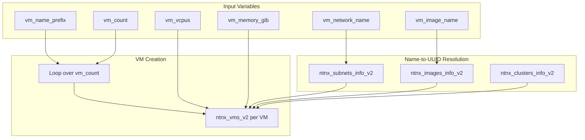

# AHV VM Create Playbook

An Ansible playbook that provisions one or more Nutanix AHV virtual machines in Prism Central using the **nutanix.ncp** collection. VMs are created with UEFI boot, an image-based boot disk, and a single vNIC attached to the specified subnet.

## Architecture

The playbook runs on **localhost** and issues API calls to Prism Central. It uses the Nutanix NCP collection (v2 modules built on Nutanix v4 APIs) for all Prism interactions.

### Flow



### Components

| Component | Module | Purpose |
|-----------|--------|---------|
| Subnet lookup | `nutanix.ncp.ntnx_subnets_info_v2` | Resolve network name to subnet UUID |
| Image lookup | `nutanix.ncp.ntnx_images_info_v2` | Resolve image name to image UUID |
| Cluster lookup | `nutanix.ncp.ntnx_clusters_info_v2` | Resolve cluster by name or use first available |
| VM creation | `nutanix.ncp.ntnx_vms_v2` | Create VM with UEFI boot, disk from image, NIC on subnet |

### VM Configuration

- **Boot**: UEFI, boot device = SCSI disk 0
- **CPU**: Single socket, configurable cores per socket
- **Memory**: GiB specified by user, converted to bytes
- **Disk**: Single disk from AHV library image (image clone); optionally sized via `system_partition_size_gib`
- **NIC**: Single vNIC on the specified subnet/network
- **Cloud-init** (optional): When `cloud_init_ssh_public_key` is set, injects a cloud-init config that creates the `nutanix` user with the given SSH key and optionally expands the system partition

### File Structure

```
playbooks/
├── README.md                    # This file
├── create_ahv_vms.yml           # Main playbook
├── templates/
│   └── cloud_init_vm.j2         # Cloud-init Jinja2 template
└── group_vars/
    └── create_ahv_vms.yml       # Example variables (optional)
```

The project root also contains `requirements.yml` for the nutanix.ncp collection.

---

## Prerequisites

- **Ansible**: ansible-core >= 2.16
- **Python**: 3.10+
- **Prism Central**: pc2024.3 or later (per Nutanix NCP collection compatibility)
- **Nutanix NCP collection**: >= 2.2.0

---

## Installation

1. **Install the collection**:

   ```bash
   ansible-galaxy collection install -r requirements.yml
   ```

2. **Install Python dependencies** for the NCP collection. On macOS with Homebrew Python (externally managed), use a virtual environment:

   ```bash
   python3 -m venv .venv
   source .venv/bin/activate  # or: .venv/bin/activate on Windows
   pip install 'ansible-core>=2.16' -r ~/.ansible/collections/ansible_collections/nutanix/ncp/requirements.txt
   ```

   Then run playbooks with the venv’s Ansible: `.venv/bin/ansible-playbook ...`

   Alternatively, if your system Python allows it:  
   `pip install -r ~/.ansible/collections/ansible_collections/nutanix/ncp/requirements.txt`

---

## Variables

### Required

| Variable | Description |
|----------|-------------|
| `vm_name_prefix` | Prefix for VM names; each VM gets `{prefix}{4-digit-index}` (e.g. `web` → `web0001`, `web0002`) |
| `vm_network_name` | Name of the subnet/network for the vNIC |
| `vm_image_name` | Name of the AHV library image (Content images) |
| `prism_host` | Prism Central IP or FQDN |
| `prism_username` | Basic auth username |
| `prism_password` | Basic auth password |

### Optional (with defaults)

| Variable | Default | Description |
|----------|---------|-------------|
| `vm_count` | 1 | Number of VMs to create |
| `vm_vcpus` | 1 | Number of vCPUs per VM |
| `vm_memory_gib` | 2 | Memory in GiB per VM |

### Optional (cluster selection)

| Variable | Description |
|----------|-------------|
| `cluster_ext_id` | Target cluster UUID; use directly without lookup |
| `cluster_name` | Target cluster name; resolved via API |
| *(neither)* | First available cluster from Prism Central |

### Optional (cloud-init)

| Variable | Description |
|----------|-------------|
| `cloud_init_ssh_public_key` | SSH public key to add to the `nutanix` user (e.g. `ssh-rsa AAAA...`). When set, enables cloud-init and creates the `nutanix` user with `sudo` privileges |
| `system_partition_size_gib` | Target size in GiB for the system partition. The boot disk is provisioned at this size and cloud-init expands the partition on first boot. Storage is derived from the target cluster (same as the image placement) |

### Optional (categories)

| Variable | Description |
|----------|-------------|
| `vm_categories` | List of `key:value` strings to apply as Nutanix categories to created VMs (e.g. `["Environment:Production", "App:Web"]`). Categories must exist in Prism Central before running the playbook. Values with colons use the first colon as the separator. |

---

## Usage

### Basic Run

Provide required variables via `-e`:

```bash
ansible-playbook playbooks/create_ahv_vms.yml \
  -i "localhost," \
  -e vm_name_prefix=web \
  -e vm_count=3 \
  -e vm_vcpus=2 \
  -e vm_memory_gib=4 \
  -e vm_network_name="Primary-VLAN" \
  -e vm_image_name="Ubuntu-22.04" \
  -e prism_host=pc.example.com \
  -e prism_username=admin \
  -e prism_password='{{ vault_prism_password }}'
```

### With Categories

Apply Nutanix categories to created VMs (categories must exist in Prism Central first):

```bash
ansible-playbook playbooks/create_ahv_vms.yml \
  -i "localhost," \
  -e vm_name_prefix=web \
  -e vm_network_name="Primary-VLAN" \
  -e vm_image_name="Ubuntu-22.04" \
  -e vm_categories='["Environment:Production","App:Web"]' \
  -e prism_host=pc.example.com \
  -e prism_username=admin \
  -e prism_password='{{ vault_prism_password }}'
```

### Using a Variables File

```bash
ansible-playbook playbooks/create_ahv_vms.yml \
  -i "localhost," \
  -e @vars/my-environment.yml
```

### Check Mode (Dry Run)

Preview what would be created without making changes:

```bash
ansible-playbook playbooks/create_ahv_vms.yml \
  -i "localhost," \
  -e @vars/my-environment.yml \
  --check
```

### With Vault-Encrypted Credentials

```bash
ansible-playbook playbooks/create_ahv_vms.yml \
  -i "localhost," \
  -e @vars/my-environment.yml \
  --ask-vault-pass
```

### With Cloud-init (SSH key and partition expansion)

```bash
ansible-playbook playbooks/create_ahv_vms.yml \
  -i "localhost," \
  -e vm_name_prefix=web \
  -e vm_network_name="Primary-VLAN" \
  -e vm_image_name="Ubuntu-22.04" \
  -e cloud_init_ssh_public_key="$(cat ~/.ssh/id_rsa.pub)" \
  -e system_partition_size_gib=50 \
  -e prism_host=pc.example.com \
  -e prism_username=admin \
  -e prism_password='{{ vault_prism_password }}'
```

### Specifying a Cluster

By name:

```bash
ansible-playbook playbooks/create_ahv_vms.yml ... -e cluster_name="prod-cluster"
```

By UUID:

```bash
ansible-playbook playbooks/create_ahv_vms.yml ... -e cluster_ext_id="33dba56c-f123-4ec6-8b38-901e1cf716c2"
```

---

## Production Safety

- **Check mode**: The playbook is compatible with `--check`. In check mode, lookups run normally; VM creation is skipped and a summary message is printed.
- **Secrets**: Tasks that handle credentials or API responses use `no_log: true`. Use `vars_prompt`, `ansible-vault`, or environment variables for credentials.
- **Validation**: Subnet and image names must match exactly one resource; the playbook fails with a clear message if the match is ambiguous or missing.
- **Cluster fallback**: If neither `cluster_ext_id` nor `cluster_name` is provided, the playbook uses the first cluster returned by the API.

---

## Troubleshooting

| Issue | Cause | Resolution |
|-------|-------|------------|
| `Subnet 'X' must match exactly one subnet` | No subnet or multiple subnets with that name | Ensure a unique subnet name in Prism Central |
| `Image 'X' must match exactly one image` | No image or multiple images with that name | Ensure a unique image name in Image Service |
| `Cluster 'X' not found or no clusters available` | No clusters or filter returned nothing | Check Prism Central; provide `cluster_ext_id` if needed |
| `One or more categories not found` | A `vm_categories` entry doesn't exist in Prism Central | Create the category (key and value) in Prism Central first; each entry must be `key:value` |
| `No storage container found for cluster` | Target cluster has no storage containers | Ensure the cluster has at least one storage container; the disk uses the same cluster as the image |
| `hosts list is empty` | No inventory | Use `-i "localhost,"` to target localhost explicitly |
