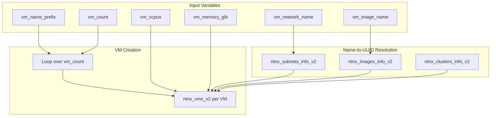
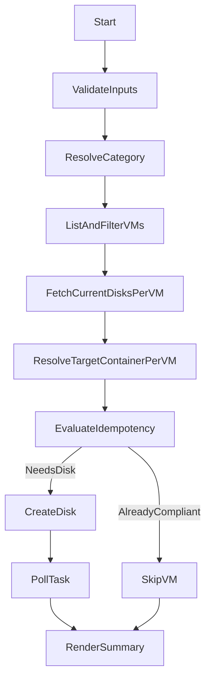
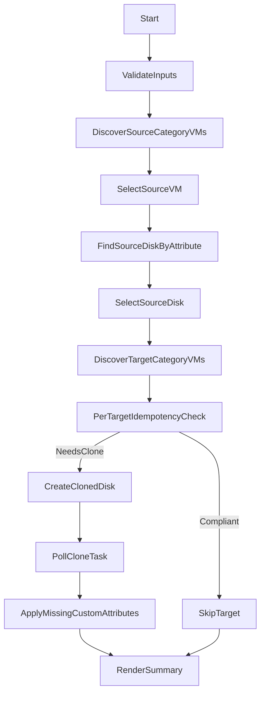
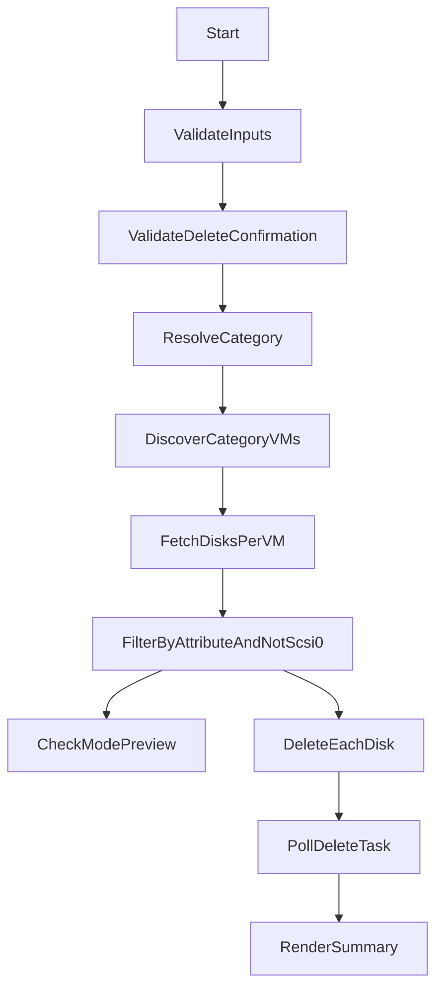
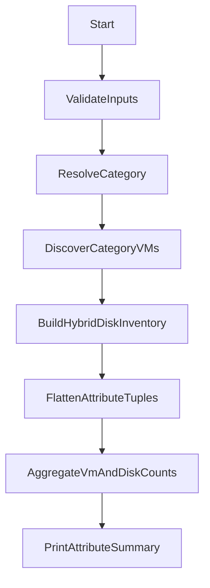
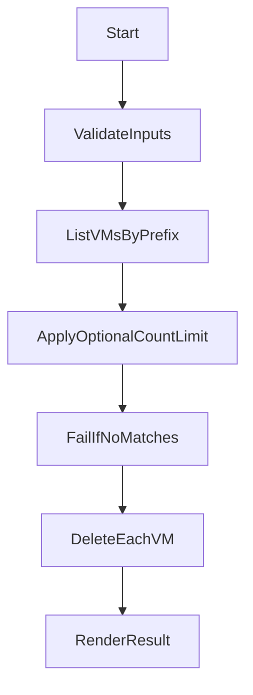

# AHV Playbooks

An Ansible playbook that provisions one or more Nutanix AHV virtual machines in Prism Central using the **nutanix.ncp** collection. VMs are created with UEFI boot, an image-based boot disk, and a single vNIC attached to the specified subnet.

## Playbook Catalog

| Playbook | Description |
|---|---|
| `create_ahv_vms.yml` | Creates one or more AHV VMs in Prism Central using the Nutanix NCP collection, with image-based boot disk, NIC assignment, and optional categories/cloud-init. |
| `delete_ahv_vms.yml` | Deletes AHV VMs in Prism Central by VM name prefix (optionally bounded by `vm_count`). |
| `add_disk_to_category_vms.yml` | Finds VMs by category and attaches a vDisk with configurable size/custom attributes, with idempotency checks and async task polling. |
| `clone_disk_between_categories.yml` | Selects a source VM/disk by category + custom attribute, then clones that disk to VMs in a target category with idempotency and task polling. |
| `clone_disk_to_image_library.yml` | Selects a source VM/disk by category + custom attribute and creates (overwrites) an AHV Image Library image from that vDisk. |
| `clone_image_to_category_vms.yml` | Resolves an image by custom-attribute-derived name and clones it to VMs in a target category with idempotency and async task tracking. |
| `clone_image_to_vm.yml` | Resolves an image by custom-attribute-derived name and clones it to a single VM selected by exact name. |
| `remove_disks_by_category_attribute.yml` | Removes non-`SCSI.0` disks matching a custom attribute from VMs in a category, with confirmation guardrails and async delete tracking. |
| `remove_disks_by_vm_attribute.yml` | Removes non-`SCSI.0` disks matching a custom attribute from a single VM selected by exact name, with confirmation and async task polling. |
| `report_disks_by_category.yml` | Reports all vDisks for VMs in a category, including VM name/UUID and per-disk UUID, size, custom attributes, SCSI index, source vDisk UUID, and image UUID. |

`tasks/create_ahv_vm_single.yml` and `tasks/delete_ahv_vm_single.yml` are internal helper task files used by the main create/delete playbooks.

## AHV VM Create Playbook

An Ansible playbook that provisions one or more Nutanix AHV virtual machines in Prism Central using the **nutanix.ncp** collection. VMs are created with UEFI boot, an image-based boot disk, and a single vNIC attached to the specified subnet.

## Architecture

The playbook runs on **localhost** and issues API calls to Prism Central. It uses the Nutanix NCP collection (v2 modules built on Nutanix v4 APIs) for all Prism interactions.

### Flow


```mermaid
flowchart TB
    subgraph Input [Input Variables]
        Prefix[vm_name_prefix]
        Count[vm_count]
        Vcpus[vm_vcpus]
        Memory[vm_memory_gib]
        Network[vm_network_name]
        Image[vm_image_name]
    end

    subgraph Lookup [Name-to-UUID Resolution]
        Subnet[ntnx_subnets_info_v2]
        ImageLookup[ntnx_images_info_v2]
        Cluster[ntnx_clusters_info_v2]
    end

    subgraph Create [VM Creation]
        Loop[Loop over vm_count]
        VM[ntnx_vms_v2 per VM]
    end

    Prefix --> Loop
    Count --> Loop
    Vcpus --> VM
    Memory --> VM
    Network --> Subnet
    Image --> ImageLookup
    Subnet --> VM
    ImageLookup --> VM
    Cluster --> VM
    Loop --> VM
```

### Components

| Component | Module | Purpose |
|-----------|--------|---------|
| Subnet lookup | `nutanix.ncp.ntnx_subnets_info_v2` | Resolve network name to subnet UUID |
| Image lookup | `nutanix.ncp.ntnx_images_info_v2` | Resolve image name to image UUID |
| Cluster lookup | `nutanix.ncp.ntnx_clusters_info_v2` | Resolve cluster by name or use first available |
| VM creation | `nutanix.ncp.ntnx_vms_v2` | Create VM with UEFI boot, disk from image, NIC on subnet |

### VM Configuration

- **Boot**: UEFI, boot device = SCSI disk 0
- **CPU**: Single socket, configurable cores per socket
- **Memory**: GiB specified by user, converted to bytes
- **Disk**: Single disk from AHV library image (image clone); optionally sized via `system_partition_size_gib`
- **NIC**: Single vNIC on the specified subnet/network
- **Cloud-init** (optional): When `cloud_init_ssh_public_key` is set, injects a cloud-init config that creates the `nutanix` user with the given SSH key and optionally expands the system partition

### File Structure

```
playbooks/
├── README.md                    # This file
├── create_ahv_vms.yml           # Main playbook
├── templates/
│   └── cloud_init_vm.j2         # Cloud-init Jinja2 template
└── group_vars/
    └── create_ahv_vms.yml       # Example variables (optional)
```

The project root also contains `requirements.yml` for the nutanix.ncp collection.

---

## Prerequisites

- **Ansible**: ansible-core >= 2.16
- **Python**: 3.10+
- **Prism Central**: pc2024.3 or later (per Nutanix NCP collection compatibility)
- **Nutanix NCP collection**: >= 2.2.0

---

## Installation

1. **Install the collection**:

   ```bash
   ansible-galaxy collection install -r requirements.yml
   ```

2. **Install Python dependencies** for the NCP collection. On macOS with Homebrew Python (externally managed), use a virtual environment:

   ```bash
   python3 -m venv .venv
   source .venv/bin/activate  # or: .venv/bin/activate on Windows
   pip install 'ansible-core>=2.16' -r ~/.ansible/collections/ansible_collections/nutanix/ncp/requirements.txt
   ```

3. **Install local Python dependencies** used by embedded helper scripts in these playbooks (`requests`, `urllib3`):

   ```bash
   pip install -r requirements.txt
   ```

   Then run playbooks with the venv’s Ansible: `.venv/bin/ansible-playbook ...`

   Alternatively, if your system Python allows it:  
   `pip install -r ~/.ansible/collections/ansible_collections/nutanix/ncp/requirements.txt`

---

## Variables

### Required

| Variable | Description |
|----------|-------------|
| `vm_name_prefix` | Prefix for VM names; each VM gets `{prefix}{4-digit-index}` (e.g. `web` → `web0001`, `web0002`) |
| `vm_network_name` | Name of the subnet/network for the vNIC |
| `vm_image_name` | Name of the AHV library image (Content images) |
| `prism_host` | Prism Central IP or FQDN |
| `prism_username` | Basic auth username |
| `prism_password` | Basic auth password |

### Optional (with defaults)

| Variable | Default | Description |
|----------|---------|-------------|
| `vm_count` | 1 | Number of VMs to create |
| `vm_vcpus` | 1 | Number of vCPUs per VM |
| `vm_memory_gib` | 2 | Memory in GiB per VM |

### Optional (cluster selection)

| Variable | Description |
|----------|-------------|
| `cluster_ext_id` | Target cluster UUID; use directly without lookup |
| `cluster_name` | Target cluster name; resolved via API |
| *(neither)* | First available cluster from Prism Central |

### Optional (cloud-init)

| Variable | Description |
|----------|-------------|
| `cloud_init_ssh_public_key` | SSH public key to add to the `nutanix` user (e.g. `ssh-rsa AAAA...`). When set, enables cloud-init and creates the `nutanix` user with `sudo` privileges |
| `system_partition_size_gib` | Target size in GiB for the system partition. The boot disk is provisioned at this size and cloud-init expands the partition on first boot. Storage is derived from the target cluster (same as the image placement) |

### Optional (categories)

| Variable | Description |
|----------|-------------|
| `vm_categories` | List of `key:value` strings to apply as Nutanix categories to created VMs (e.g. `["Environment:Production", "App:Web"]`). Categories must exist in Prism Central before running the playbook. Values with colons use the first colon as the separator. |

---

## Usage

### Basic Run

Provide required variables via `-e`:

```bash
ansible-playbook playbooks/create_ahv_vms.yml \
  -i "localhost," \
  -e vm_name_prefix=web \
  -e vm_count=3 \
  -e vm_vcpus=2 \
  -e vm_memory_gib=4 \
  -e vm_network_name="Primary-VLAN" \
  -e vm_image_name="Ubuntu-22.04" \
  -e prism_host=pc.example.com \
  -e prism_username=admin \
  -e prism_password='{{ vault_prism_password }}'
```

### With Categories

Apply Nutanix categories to created VMs (categories must exist in Prism Central first):

```bash
ansible-playbook playbooks/create_ahv_vms.yml \
  -i "localhost," \
  -e vm_name_prefix=web \
  -e vm_network_name="Primary-VLAN" \
  -e vm_image_name="Ubuntu-22.04" \
  -e vm_categories='["Environment:Production","App:Web"]' \
  -e prism_host=pc.example.com \
  -e prism_username=admin \
  -e prism_password='{{ vault_prism_password }}'
```

### Using a Variables File

```bash
ansible-playbook playbooks/create_ahv_vms.yml \
  -i "localhost," \
  -e @vars/my-environment.yml
```

### Check Mode (Dry Run)

Preview what would be created without making changes:

```bash
ansible-playbook playbooks/create_ahv_vms.yml \
  -i "localhost," \
  -e @vars/my-environment.yml \
  --check
```

### With Vault-Encrypted Credentials

```bash
ansible-playbook playbooks/create_ahv_vms.yml \
  -i "localhost," \
  -e @vars/my-environment.yml \
  --ask-vault-pass
```

### With Cloud-init (SSH key and partition expansion)

```bash
ansible-playbook playbooks/create_ahv_vms.yml \
  -i "localhost," \
  -e vm_name_prefix=web \
  -e vm_network_name="Primary-VLAN" \
  -e vm_image_name="Ubuntu-22.04" \
  -e cloud_init_ssh_public_key="$(cat ~/.ssh/id_rsa.pub)" \
  -e system_partition_size_gib=50 \
  -e prism_host=pc.example.com \
  -e prism_username=admin \
  -e prism_password='{{ vault_prism_password }}'
```

### Specifying a Cluster

By name:

```bash
ansible-playbook playbooks/create_ahv_vms.yml ... -e cluster_name="prod-cluster"
```

By UUID:

```bash
ansible-playbook playbooks/create_ahv_vms.yml ... -e cluster_ext_id="33dba56c-f123-4ec6-8b38-901e1cf716c2"
```

---

## Production Safety

- **Check mode**: The playbook is compatible with `--check`. In check mode, lookups run normally; VM creation is skipped and a summary message is printed.
- **Secrets**: Tasks that handle credentials or API responses use `no_log: true`. Use `vars_prompt`, `ansible-vault`, or environment variables for credentials.
- **Validation**: Subnet and image names must match exactly one resource; the playbook fails with a clear message if the match is ambiguous or missing.
- **Cluster fallback**: If neither `cluster_ext_id` nor `cluster_name` is provided, the playbook uses the first cluster returned by the API.

---

## Troubleshooting

| Issue | Cause | Resolution |
|-------|-------|------------|
| `Subnet 'X' must match exactly one subnet` | No subnet or multiple subnets with that name | Ensure a unique subnet name in Prism Central |
| `Image 'X' must match exactly one image` | No image or multiple images with that name | Ensure a unique image name in Image Service |
| `Cluster 'X' not found or no clusters available` | No clusters or filter returned nothing | Check Prism Central; provide `cluster_ext_id` if needed |
| `One or more categories not found` | A `vm_categories` entry doesn't exist in Prism Central | Create the category (key and value) in Prism Central first; each entry must be `key:value` |
| `No storage container found for cluster` | Target cluster has no storage containers | Ensure the cluster has at least one storage container; the disk uses the same cluster as the image |
| `hosts list is empty` | No inventory | Use `-i "localhost,"` to target localhost explicitly |

---

## Add vDisk To Category VMs (`add_disk_to_category_vms.yml`)

Attaches a vDisk to all VMs in a specified category, with per-VM storage-container resolution, idempotency checks (size/container/custom attributes), and async task polling.


```mermaid
flowchart TD
  startAdd[Start] --> validateAdd[ValidateInputs]
  validateAdd --> resolveCategoryAdd[ResolveCategory]
  resolveCategoryAdd --> listVmsAdd[ListAndFilterVMs]
  listVmsAdd --> fetchDisksAdd[FetchCurrentDisksPerVM]
  fetchDisksAdd --> resolveContainerAdd[ResolveTargetContainerPerVM]
  resolveContainerAdd --> idempotencyAdd[EvaluateIdempotency]
  idempotencyAdd -->|AlreadyCompliant| skipAdd[SkipVM]
  idempotencyAdd -->|NeedsDisk| createDiskAdd[CreateDisk]
  createDiskAdd --> pollCreateAdd[PollTask]
  pollCreateAdd --> reportAdd[RenderSummary]
  skipAdd --> reportAdd
```

Key inputs:
- `pc_ip`, `pc_username`, `pc_password`
- `category_key`, `category_value`
- Optional disk parameters from `vars/disk_attach_defaults.yml`

Performance behavior:
- Fetches VM pages with retry + exponential backoff and concurrent page retrieval (`vm_page_fetch_concurrency`).
- Uses embedded `vm.disks` first; falls back to concurrent per-VM `/disks` calls only when needed (`disk_fetch_concurrency`).
- Resolves storage container name lookups concurrently and de-duplicated by cluster.
- Executes attach flow concurrently for ETag fetch, disk submit, and task polling.
- Emits live progress lines for long-running stages in the form `PROGRESS stage=<name> ...`.
- Progress cadence is controlled by `operation_progress_every` in `vars/disk_attach_defaults.yml`.

Example command (with overrides):

```bash
ansible-playbook playbooks/add_disk_to_category_vms.yml \
  --vault-password-file ~/.ansible/.vault_pass.txt \
  -e @vars/my-environment.yml \
  -e pc_ip=pc.example.com \
  -e category_key=odt \
  -e category_value=reference \
  -e disk_size_bytes=107374182400 \
  -e 'custom_attributes=["release:v1.0.0","owner:sre"]' \
  -e operation_progress_every=10 \
  -e disk_bus_type=SCSI \
  -e flash_mode_enabled=false
```

---

## Clone Disk Between Categories (`clone_disk_between_categories.yml`)

Selects a source VM (interactive when multiple), selects a source disk by custom attribute, and clones that disk to VMs in another category with idempotency and post-clone custom-attribute preservation.


```mermaid
flowchart TD
  startClone[Start] --> validateClone[ValidateInputs]
  validateClone --> sourceDiscoveryClone[DiscoverSourceCategoryVMs]
  sourceDiscoveryClone --> sourcePickClone[SelectSourceVM]
  sourcePickClone --> sourceDiskFindClone[FindSourceDiskByAttribute]
  sourceDiskFindClone --> sourceDiskPickClone[SelectSourceDisk]
  sourceDiskPickClone --> targetDiscoveryClone[DiscoverTargetCategoryVMs]
  targetDiscoveryClone --> idempotencyClone[PerTargetIdempotencyCheck]
  idempotencyClone -->|Compliant| skipClone[SkipTarget]
  idempotencyClone -->|NeedsClone| cloneSubmit[CreateClonedDisk]
  cloneSubmit --> clonePoll[PollCloneTask]
  clonePoll --> attrSyncClone[ApplyMissingCustomAttributes]
  attrSyncClone --> reportClone[RenderSummary]
  skipClone --> reportClone
```

Key inputs:
- `pc_ip`, `pc_username`, `pc_password`
- `source_category_key`, `source_category_value`
- `target_category_key`, `target_category_value`
- `source_disk_custom_attribute`

Performance behavior:
- Fetches VM pages with retry + exponential backoff and concurrent page retrieval (`vm_page_fetch_concurrency`).
- Uses embedded target `vm.disks` first; falls back to concurrent per-VM `/disks` calls only when needed (`disk_fetch_concurrency`).
- Executes clone flow concurrently for source/target filtering, ETag fetch, clone submit, and task polling.
- Emits live progress lines for long-running stages in the form `PROGRESS stage=<name> ...`.
- Progress cadence is controlled by `operation_progress_every` in `vars/disk_clone_defaults.yml`.
- For maximum speed, post-clone full disk inventory verification is disabled by default (`verify_post_clone_attributes=false`).
- Enable `verify_post_clone_attributes=true` only when you need strict post-clone custom-attribute verification/sync.

Example command (with overrides):

```bash
ansible-playbook playbooks/clone_disk_between_categories.yml \
  --vault-password-file ~/.ansible/.vault_pass.txt \
  -e @vars/my-environment.yml \
  -e pc_ip=pc.example.com \
  -e source_category_key=odt \
  -e source_category_value=reference \
  -e target_category_key=odt \
  -e target_category_value=agent \
  -e source_disk_custom_attribute='release:v1.0.0' \
  -e operation_progress_every=10 \
  -e verify_post_clone_attributes=false \
  -e clone_disk_bus_type=SCSI \
  -e copy_source_custom_attributes=true
```

---

## Clone Disk To Image Library (`clone_disk_to_image_library.yml`)

Finds a source VM/disk by category and custom attribute, then creates an AHV Image Library image from that vDisk. If an image with the derived name already exists, it is deleted first and recreated (overwrite behavior).

Key inputs:
- `pc_ip`, `pc_username`, `pc_password`
- `source_category_key`, `source_category_value`
- `source_disk_custom_attribute`

Behavior notes:
- Image name is derived from custom attribute parts (`<name>_<value>`).
- Image description includes source VM context and timestamp.
- Existing same-name images are removed before create (overwrite).
- Uses async task polling for both delete and create operations.

Example command:

```bash
ansible-playbook playbooks/clone_disk_to_image_library.yml \
  --vault-password-file ~/.ansible/.vault_pass.txt \
  -e @vars/my-environment.yml \
  -e pc_ip=pc.example.com \
  -e source_category_key=odt \
  -e source_category_value=reference \
  -e source_disk_custom_attribute='release:v1.1.0'
```

---

## Clone Image To Category VMs (`clone_image_to_category_vms.yml`)

Resolves a source image from a custom-attribute-derived name, then clones that image as a disk to all VMs in a target category using high-concurrency stages (VM discovery, ETag fetch, clone submit, and task polling).

Key inputs:
- `pc_ip`, `pc_username`, `pc_password`
- `target_category_key`, `target_category_value`
- `source_disk_custom_attribute`

Behavior notes:
- Source image name is derived from custom attribute (`<name>_<value>`).
- Uses idempotency classification:
  - `clone_apply`: no equivalent image-backed disk present.
  - `attr_only_apply`: equivalent disk exists but missing attribute (kept for reporting).
  - `clone_skipped`: equivalent disk already present.
- Custom attribute is set directly on disk creation payload during clone submit.

Example command:

```bash
ansible-playbook playbooks/clone_image_to_category_vms.yml \
  --vault-password-file ~/.ansible/.vault_pass.txt \
  -e @vars/my-environment.yml \
  -e pc_ip=pc.example.com \
  -e target_category_key=odt \
  -e target_category_value=agent \
  -e source_disk_custom_attribute='release:v1.1.0'
```

---

## Clone Image To Single VM (`clone_image_to_vm.yml`)

Resolves a source image from a custom-attribute-derived name, then clones that image as a disk to one user-specified VM name.

Key inputs:
- `pc_ip`, `pc_username`, `pc_password`
- `target_vm_name`
- `source_disk_custom_attribute`

Behavior notes:
- Source image name is derived from custom attribute (`<name>_<value>`).
- Target VM is resolved by exact name; lookup must return exactly one VM.
- Idempotency checks existing image-backed disks on that VM before cloning.
- Custom attribute is set directly in the disk clone payload.

Example command:

```bash
ansible-playbook playbooks/clone_image_to_vm.yml \
  --vault-password-file ~/.ansible/.vault_pass.txt \
  -e @vars/my-environment.yml \
  -e pc_ip=pc.example.com \
  -e target_vm_name=my-target-vm-01 \
  -e source_disk_custom_attribute='release:v1.1.0'
```

---

## Remove Disks By Category Attribute (`remove_disks_by_category_attribute.yml`)

Removes all disks (except `SCSI.0`) that match a specified custom attribute from VMs in a specified category. Includes destructive-action confirmation guard and per-disk async task tracking.


```mermaid
flowchart TD
  startRemove[Start] --> validateRemove[ValidateInputs]
  validateRemove --> confirmRemove[ValidateDeleteConfirmation]
  confirmRemove --> resolveCategoryRemove[ResolveCategory]
  resolveCategoryRemove --> discoverVmsRemove[DiscoverCategoryVMs]
  discoverVmsRemove --> discoverDisksRemove[FetchDisksPerVM]
  discoverDisksRemove --> filterDisksRemove[FilterByAttributeAndNotScsi0]
  filterDisksRemove --> previewRemove[CheckModePreview]
  filterDisksRemove --> deleteLoopRemove[DeleteEachDisk]
  deleteLoopRemove --> pollDeleteRemove[PollDeleteTask]
  pollDeleteRemove --> summaryRemove[RenderSummary]
```

Key inputs:
- `pc_ip`, `pc_username`, `pc_password`
- `category_key`, `category_value`
- `disk_custom_attribute`
- `delete_confirm=DELETE` for real execution

Performance behavior:
- Fetches VM pages with retry + exponential backoff and concurrent page retrieval (`vm_page_fetch_concurrency`).
- Uses embedded `vm.disks` first; falls back to concurrent per-VM `/disks` calls only when needed (`disk_fetch_concurrency`).
- Builds disk-delete targets in one Python pass for faster local processing on large VM sets.
- Preserves safe delete behavior (fresh ETag per disk delete).
- Emits live progress lines for fallback fetch and delete stages in the form `PROGRESS stage=<name> ...`.
- Progress cadence is controlled by `operation_progress_every` and `delete_progress_every` in `vars/disk_remove_defaults.yml`.
- Deletes run in chunks for guaranteed visible progress updates (`delete_chunk_size` in `vars/disk_remove_defaults.yml`).

Example command (with overrides):

```bash
ansible-playbook playbooks/remove_disks_by_category_attribute.yml \
  --vault-password-file ~/.ansible/.vault_pass.txt \
  -e @vars/my-environment.yml \
  -e pc_ip=pc.example.com \
  -e category_key=odt \
  -e category_value=agent \
  -e disk_custom_attribute='release:v1.0.0' \
  -e delete_confirm=DELETE \
  -e operation_progress_every=10 \
  -e delete_progress_every=5 \
  -e delete_chunk_size=20 \
  -e task_poll_retries=60 \
  -e task_poll_delay_seconds=5
```

---

## Remove Disks By VM Attribute (`remove_disks_by_vm_attribute.yml`)

Removes all disks (except `SCSI.0`) that match a specified custom attribute from one user-specified VM name.

Key inputs:
- `pc_ip`, `pc_username`, `pc_password`
- `target_vm_name`
- `disk_custom_attribute`
- `delete_confirm=DELETE` for real execution

Example command:

```bash
ansible-playbook playbooks/remove_disks_by_vm_attribute.yml \
  --vault-password-file ~/.ansible/.vault_pass.txt \
  -e @vars/my-environment.yml \
  -e pc_ip=pc.example.com \
  -e target_vm_name=my-target-vm-01 \
  -e disk_custom_attribute='release:v1.0.0' \
  -e delete_confirm=DELETE
```

---

## Report Disks By Category (`report_disks_by_category.yml`)

Produces a read-only aggregated report for all VMs in a category, grouped by vDisk custom attribute:
- `custom_attribute`
- `vm_count` (distinct VMs containing that attribute)
- `disk_count` (total disk occurrences containing that attribute)

Disks without custom attributes are excluded from the summary.

Performance behavior:
- Uses embedded `vm.disks` from VM inventory when available.
- Falls back to per-VM `/disks` API calls only for VMs missing embedded disk data.
- Executes fallback disk fetches concurrently with bounded fan-out (`disk_fetch_concurrency`).
- Fetches VM pages with retry + exponential backoff, and concurrent page retrieval (`vm_page_fetch_concurrency`).
- Aggregates attribute counts in one Python pass (instead of iterative Ansible set_fact loops).
- Emits live progress lines for page fetch, fallback disk fetch, and aggregation stages in the form `PROGRESS stage=<name> ...`.
- Progress cadence is controlled by `operation_progress_every` in `vars/disk_report_defaults.yml`.

Example progress output:

```text
PROGRESS stage=attach_submit total=120
PROGRESS stage=attach_submit processed=25/120 success=25 failed=0
PROGRESS stage=attach_submit processed=50/120 success=49 failed=1
```

Recommended progress cadence:
- `<100` VMs: `operation_progress_every=5` (and `delete_progress_every=5` for remove).
- `100-500` VMs: `operation_progress_every=25` (and `delete_progress_every=25` for remove).
- `>500` VMs: `operation_progress_every=50` (and `delete_progress_every=50` for remove).
- If logs are too noisy, increase the value; if the run appears idle, decrease it.


```mermaid
flowchart TD
  startReport[Start] --> validateReport[ValidateInputs]
  validateReport --> resolveCategoryReport[ResolveCategory]
  resolveCategoryReport --> discoverVmsReport[DiscoverCategoryVMs]
  discoverVmsReport --> fetchDisksReport[BuildHybridDiskInventory]
  fetchDisksReport --> flattenReport[FlattenAttributeTuples]
  flattenReport --> aggregateReport[AggregateVmAndDiskCounts]
  aggregateReport --> printReport[PrintAttributeSummary]
```

Key inputs:
- `pc_ip`, `pc_username`, `pc_password`
- `category_key`, `category_value`

Example command (with overrides):

```bash
ansible-playbook playbooks/report_disks_by_category.yml \
  --vault-password-file ~/.ansible/.vault_pass.txt \
  -e @vars/my-environment.yml \
  -e pc_ip=pc.example.com \
  -e category_key=odt \
  -e category_value=agent \
  -e api_page_limit=100 \
  -e disk_fetch_concurrency=16 \
  -e operation_progress_every=25 \
  -e vm_page_fetch_concurrency=12 \
  -e vm_page_fetch_retries=6
```

---

## Delete AHV VMs By Prefix (`delete_ahv_vms.yml`)

Deletes VMs by name prefix in Prism Central (optionally limited by `vm_count`), primarily as the companion cleanup playbook for `create_ahv_vms.yml`.


```mermaid
flowchart TD
  startDeleteVm[Start] --> validateDeleteVm[ValidateInputs]
  validateDeleteVm --> listDeleteVm[ListVMsByPrefix]
  listDeleteVm --> selectDeleteVm[ApplyOptionalCountLimit]
  selectDeleteVm --> noVmCheckDeleteVm[FailIfNoMatches]
  noVmCheckDeleteVm --> deleteLoopVm[DeleteEachVM]
  deleteLoopVm --> summaryDeleteVm[RenderResult]
```

Key inputs:
- `vm_name_prefix`
- `prism_host`, `prism_username`, `prism_password`

Example command (with overrides):

```bash
ansible-playbook playbooks/delete_ahv_vms.yml \
  -i "localhost," \
  -e @vars/my-environment.yml \
  -e vm_name_prefix=ttvm- \
  -e vm_count=5
```
